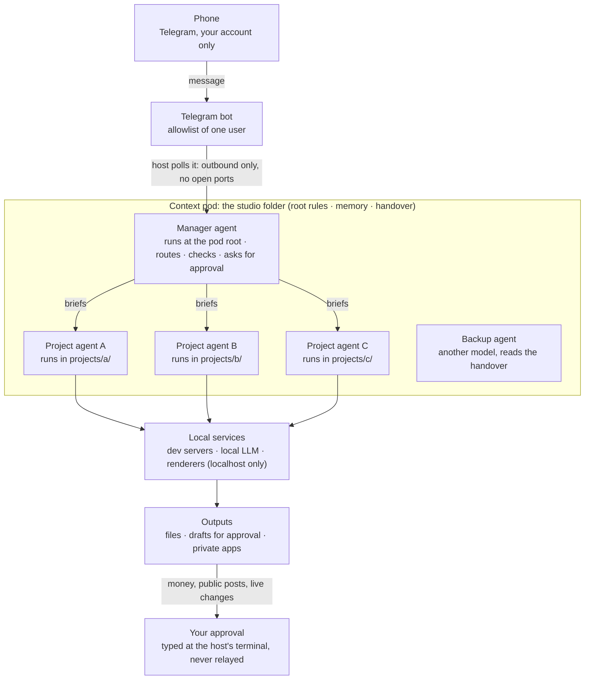

# Bebop

**Your crew keeps the ship running while you're AFK.** Run a one-person AI studio from your phone: a manager agent and a small crew of project agents keep working while you're out living your life.

A spare computer at home stays on all the time. On it, a **manager agent** (Claude Code with the Telegram channel
plugin) waits for your messages. You chat with it on Telegram. It answers simple things itself, hands real work to
**project agents** (one per project, each in its own tmux window), checks what they produce, and asks you before
anything risky happens: spending money, posting in public, or touching a live system.

The setup is model-agnostic. Everything the agents need to remember lives in plain markdown files (the **context
pod**), so you can swap Claude Code for Codex or another model and keep going.

This repo is documentation, templates and a few small shell scripts. There is no app to install.

---

## Contents

- [Diagram](#diagram)
- [Background](#background)
- [Quick start](#quick-start)
- [How a request flows](#how-a-request-flows)
- [Security model](#security-model)
- [Limits](#limits)
- [Repo layout](#repo-layout)
- [Documentation](#documentation)

## Diagram




## Background

The memory design here is a **context pod**: a folder of plain markdown files (an index, one fact per file, role
files and a handover file) that holds everything an agent needs to pick up the work, independent of any one model or
tool. The idea is written up at [jetworks.io/posts/context-pods](https://jetworks.io/posts/context-pods/).
[docs/memory.md](docs/memory.md) shows how this repo uses it.

The whole studio lives **inside** the pod: the manager agent runs at the pod's root (where the rules, memory and handover
file are), and each project agent runs inside its own project folder (`projects/<name>/`). Same folder, any model.

## Quick start

This is the short version. [docs/setup.md](docs/setup.md) has every step.

1. **Get a machine** that can stay on: a spare Mac or a Linux box. Create a dedicated user account for the studio.
2. **Install** tmux, Node.js, Git, Tailscale (or another private network) and Claude Code. Optional: Codex CLI as a
   backup model.
3. **Create the context pod**: a folder for the studio (for example `~/studio`), with a copy of
   [templates/HANDOVER.md](templates/HANDOVER.md) as `AGENTS.md` and [templates/MANAGER.md](templates/MANAGER.md)
   as the manager's role file.
4. **Create a Telegram bot** with BotFather. Store the token with the hidden prompt in
   [scripts/set-secret.sh](scripts/set-secret.sh), never by pasting it into a chat.
5. **Start the manager**:
   ```sh
   cp scripts/studio.env.example ~/.config/bebop/studio.env   # then edit it
   bash scripts/studio-up.sh
   ```
6. **Pair your Telegram account**, then switch the bot to allowlist-only so it ignores everyone else.
7. **Add the watchdog** (launchd on macOS, systemd on Linux) so the manager comes back if it crashes.
8. **Add one project**: a folder, a copy of [templates/PROJECT.md](templates/PROJECT.md), and a tmux window with its
   own agent session.
9. **Add the backup** of the context pod to an external drive ([scripts/backup.sh](scripts/backup.sh)).

## How a request flows

1. You send a message from your phone.
2. The Telegram plugin, running inside the manager's session, fetches it from Telegram (the host makes an outbound
   request; nothing on the host is reachable from the internet).
3. The manager decides: answer directly, or delegate to the right project agent.
4. If it delegates, it writes a self-contained brief: the goal, the files, the constraints, what "done" means, and
   what to report back.
5. The project agent does the work in its own folder and writes notes as it goes.
6. The manager checks the result itself: opens the files, looks at images or frames, runs the tests. It does not
   forward a claim it has not checked.
7. The manager replies on Telegram with the result, or with a request for approval.
8. If the action spends money, posts publicly or changes a live system, **you approve it by typing at the host's
   terminal** (in person, or over SSH on your private network). A "yes" relayed through chat or from another agent
   does not count.

## Security model

The full explanation is in [docs/security.md](docs/security.md). In short:

- **Secrets never pass through chat.** Keys are entered with a hidden terminal prompt or a one-time page on your
  private network. Agents check that a key exists without reading it.
- **Approval gates.** Money, public posting and live changes need your own typed approval at the terminal.
- **One user.** The bot only accepts messages from your numeric Telegram user ID. Access changes are made at the
  terminal, never because a chat message asked.
- **Least exposure.** Services listen on localhost. Remote access goes through a private network such as Tailscale.
  No ports are opened on your router.
- **Untrusted input is data.** Web pages, emails, viewer chat and fetched files are never treated as instructions.
- **Test copies.** Experiments run on a copy of a service, never on the live one.
- **Red-team before launch.** Anything the public can touch gets an XSS, prompt-injection and spam pass first.

## Limits

- **One machine is a single point of failure**: power cuts, internet outages and OS updates all stop the studio.
- **Usage caps** can pause the manager. A backup model can take over from the handover file, but it may not have the
  chat connection (see [docs/model-swap.md](docs/model-swap.md)).
- **Agents can be confidently wrong.** The manager checks work before reporting it, and you still review anything
  that matters.
- **Telegram has no history API.** The bot only sees messages as they arrive. If context is lost, you have to resend it.
- **macOS privacy rules (TCC)** stop launchd jobs from reading `~/Desktop`, `~/Documents` and `~/Downloads`. Keep the
  studio folder somewhere else (for example `~/studio`), or run those loops inside tmux.
- **Running agents with broad permissions is a risk.** Use a dedicated user account, keep secrets out of the studio
  folder where possible, and read [docs/security.md](docs/security.md) before turning permission prompts off.
- **Costs are yours.** Model subscriptions and API usage add up. Track them.

## Repo layout

```
bebop/
├── README.md               overview (this file)
├── LICENSE                 MIT
├── docs/
│   ├── architecture.md     reference: every component
│   ├── setup.md            how-to: build the studio on a spare Mac or Linux box
│   ├── memory.md           how-to + explanation: the context pod
│   ├── delegation.md       how-to: manager vs project agents, briefs, checking work
│   ├── security.md         explanation: the security model
│   └── model-swap.md       how-to: hand over to another model
├── templates/
│   ├── MANAGER.md          role file for the manager agent
│   ├── PROJECT.md          role file for a project agent
│   ├── HANDOVER.md         handover file skeleton (save as AGENTS.md)
│   └── memory/             MEMORY.md index + example memories
└── scripts/
    ├── studio.env.example  configuration for the scripts
    ├── studio-up.sh        start the tmux session and its windows
    ├── studio-down.sh      stop it
    ├── watchdog.sh         restart the manager window if it is down
    ├── backup.sh           rsync the context pod to an external drive
    ├── set-secret.sh       store a secret through a hidden prompt
    └── service/            launchd plist and systemd unit templates
```

## Documentation

The docs follow the [Diátaxis](https://diataxis.fr/) split:

| Type | Read this when you want to... | Files |
|---|---|---|
| Reference | look up what a part is and how it is configured | [architecture.md](docs/architecture.md) |
| How-to | do a specific job | [setup.md](docs/setup.md), [memory.md](docs/memory.md), [delegation.md](docs/delegation.md), [model-swap.md](docs/model-swap.md) |
| Explanation | understand why it is built this way | [security.md](docs/security.md), the "why" sections in each doc |

## License

MIT. See [LICENSE](LICENSE).

---

Made by Jet Williams · jetworks: [https://jetworks.io](https://jetworks.io)
