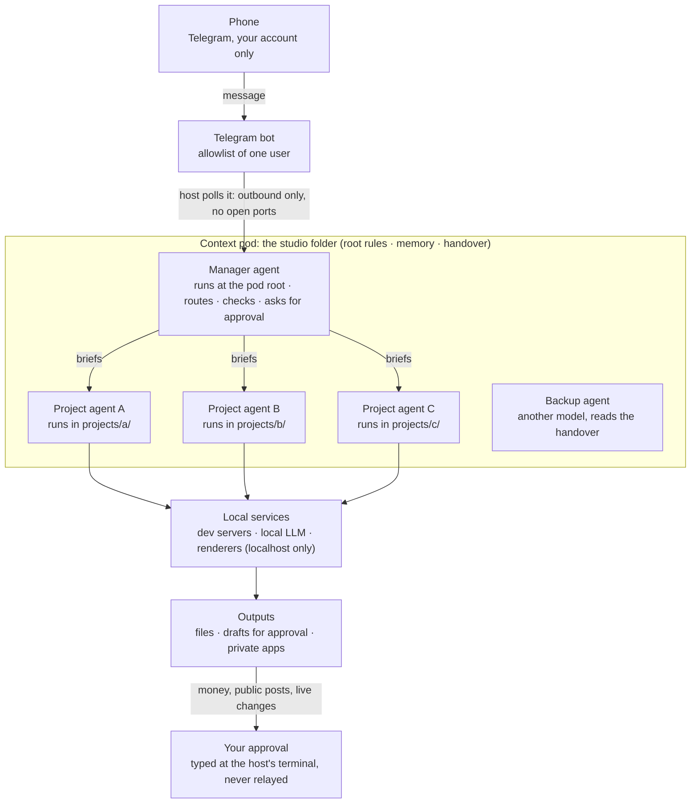

# Architecture (reference)

This page lists every part of a Bebop setup, what it does, where it runs and how it is configured. For the
reasons behind the design, see [security.md](security.md) and the "Why" notes in the other docs.



## Components

| Component | What it does | Runs on | Configured in |
|---|---|---|---|
| **Host** | An always-on computer (spare Mac or Linux box) that runs every agent and service. | Home | OS settings: auto-login, no sleep, restart after power failure |
| **Studio user account** | A dedicated OS user for the studio, so agents can't reach your personal files. | Host | OS user management |
| **Private network** | Lets your phone and laptop reach the host (SSH, internal web pages) without opening any port to the internet. Tailscale is one option; WireGuard is another. | Host + your devices | Tailscale admin console / WireGuard config |
| **Telegram bot** | Your chat window into the studio. Created with BotFather. | Telegram's servers | BotFather |
| **Telegram channel plugin** | A Claude Code plugin that logs in as the bot, polls Telegram for new messages (outbound only) and passes them into the manager's session. Gives the agent `reply`, `react` and `edit_message` tools. | Host, inside the manager's session | Token: `~/.claude/channels/telegram/.env`. Access list: `~/.claude/channels/telegram/access.json` |
| **Manager agent** | A Claude Code session started with `--channels`. Receives your messages, answers or delegates, checks results, asks for approvals, tracks status. Does no project work itself. | tmux window `manager` | Role file: `MANAGER.md` (from [templates/MANAGER.md](../templates/MANAGER.md)) |
| **Project agents** | One agent session per project, each in its own folder with its own notes. Does the actual work. | One tmux window each | Role file: `PROJECT.md` in each project folder (from [templates/PROJECT.md](../templates/PROJECT.md)) |
| **Backup agent** | Another model (for example the Codex CLI) that takes over when the main model is unavailable. | tmux window or terminal | Handover file: `AGENTS.md` (from [templates/HANDOVER.md](../templates/HANDOVER.md)) |
| **Context pod** | Plain markdown files that hold everything the agents need to remember: a handover file, role files, a memory index and one-fact-per-file memories, plus per-project notes. | `STUDIO_DIR` on the host | See [memory.md](memory.md) |
| **tmux** | Keeps every agent and server running when you disconnect. One session, one window per agent or service. | Host | `STUDIO_SESSION`, `STUDIO_WINDOWS` in `studio.env` |
| **studio-up / studio-down** | Start or stop the tmux session and its windows in a known state. | Host | [scripts/studio-up.sh](../scripts/studio-up.sh), [scripts/studio-down.sh](../scripts/studio-down.sh) |
| **Watchdog** | Every 5 minutes, checks that the manager is running and restarts only the manager window if it is not. | launchd (macOS) or a systemd timer (Linux) | [scripts/watchdog.sh](../scripts/watchdog.sh), [scripts/service/](../scripts/service/) |
| **Backup** | Mirrors the context pod (and the agents' memory folders) to an external drive. Excludes secrets. Keeps deleted files in a dated folder. | tmux loop, cron, launchd or systemd | [scripts/backup.sh](../scripts/backup.sh), `BACKUP_*` in `studio.env` |
| **Secret store** | `.env` files with permissions 600, written by a hidden prompt. Agents check a key exists; they never read it out. | Host | [scripts/set-secret.sh](../scripts/set-secret.sh) |
| **Local services** (optional) | Whatever your projects need: dev servers, a local LLM (for example ollama), text-to-speech, renderers. Bound to localhost. | Host | Per project |
| **Test copies** (optional) | A second instance of any live service, on another port and folder, for experiments. | Host | Per project |
| **MCP tools** (optional) | Plugins that give agents extra abilities (design tools, 3D software, docs). | Host | Claude Code / Codex MCP settings |

## Files and folders

A suggested layout for the context pod. Nothing in the scripts depends on it except `STUDIO_DIR`.

```
$STUDIO_DIR/                 e.g. ~/studio
├── AGENTS.md                handover file: read first by any model (templates/HANDOVER.md)
├── MANAGER.md               the manager's role (templates/MANAGER.md)
├── OWNER_TODO.md            things only you can do: keys, accounts, approvals
├── memory/
│   ├── MEMORY.md            index: one line per memory
│   └── *.md                 one fact per file, with frontmatter
├── projects/
│   └── <project>/
│       ├── PROJECT.md       the project agent's role (templates/PROJECT.md)
│       ├── NOTES.md         running notes: status, decisions, handback notes
│       └── ...              the project's own files
└── ops/                     your copy of scripts/ (if you want it inside the pod)
```

Claude Code also keeps its own per-project memory under `~/.claude/projects/<folder>/memory/`, which it reads
automatically. You can use that, the `memory/` folder above, or both. See [memory.md](memory.md).

## Configuration variables

All scripts read `~/.config/bebop/studio.env` (or the file in `STUDIO_CONFIG`). Template:
[scripts/studio.env.example](../scripts/studio.env.example).

| Variable | Default | Used by | Meaning |
|---|---|---|---|
| `STUDIO_CONFIG` | `~/.config/bebop/studio.env` | all | Path of the config file itself (set in the environment) |
| `STUDIO_DIR` | `~/studio` | all | The context pod folder |
| `STUDIO_SESSION` | `studio` | up, down, watchdog | tmux session name |
| `MANAGER_WINDOW` | `manager` | up, down, watchdog | tmux window that holds the manager |
| `MANAGER_CMD` | `claude --continue --channels plugin:telegram@claude-plugins-official \|\| claude --channels ...` | up, watchdog | Command typed into the manager window |
| `MANAGER_MATCH` | `claude.*--channels` | up, watchdog | `pgrep -f` pattern that means "the manager is running" |
| `STUDIO_WINDOWS` | empty | up, down | Extra windows, one per line: `name\|dir\|command` |
| `LOG_DIR` | `~/.local/state/bebop` | all | Log folder |
| `STOP_GRACE` | `5` | down | Seconds between Ctrl-C and closing a window |
| `BACKUP_VOLUME` | empty | backup | Mount point that must exist for a backup to run |
| `BACKUP_DEST` | empty | backup | Backup folder; must be inside `BACKUP_VOLUME` |
| `BACKUP_AGENT_MEMORY` | `yes` | backup | Also copy `~/.claude` memory, instructions and settings (never credentials) |

## Network exposure

| What | Listens on | Reachable from |
|---|---|---|
| Telegram plugin | nothing (it polls outbound) | n/a |
| Local services | `127.0.0.1` | the host only |
| Internal pages you want on your phone | `127.0.0.1`, published with your private network's proxy (for example `tailscale serve`) | your private network only |
| SSH | the host | your private network only (do not forward it on your router) |
